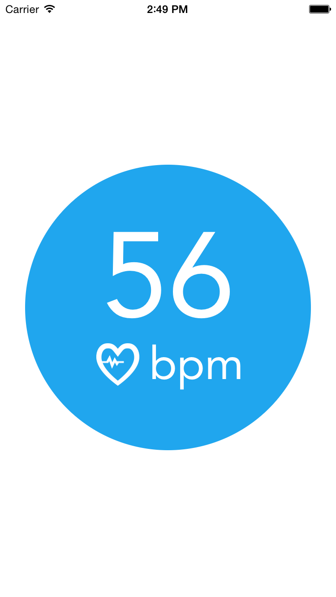
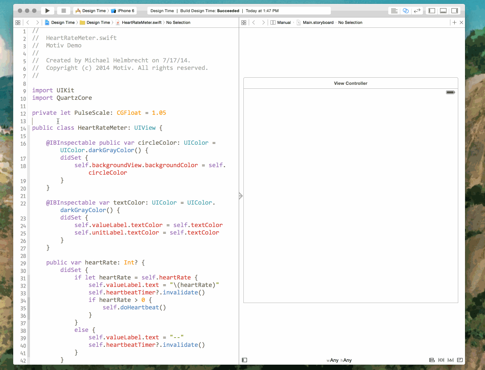
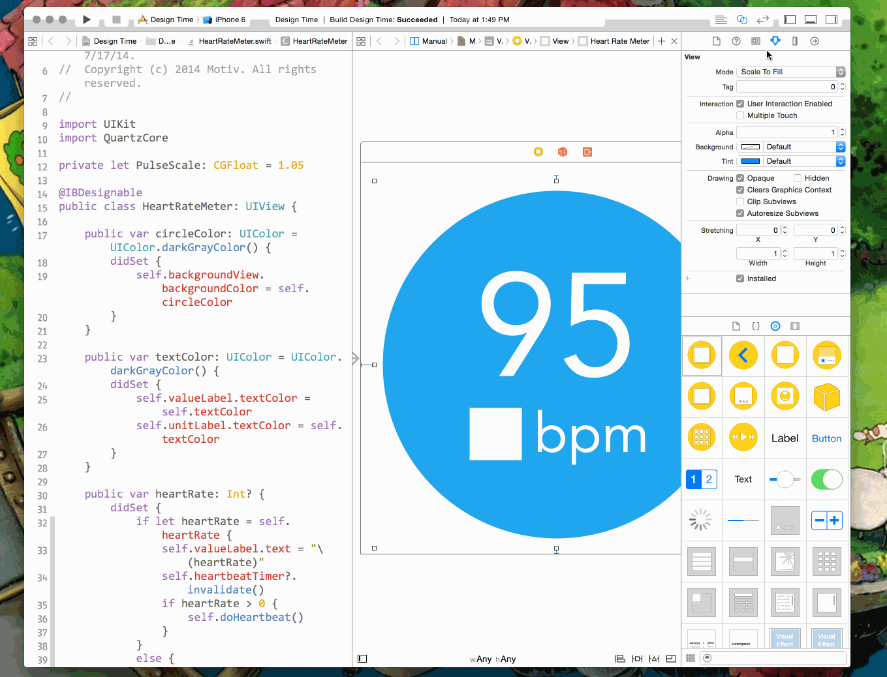
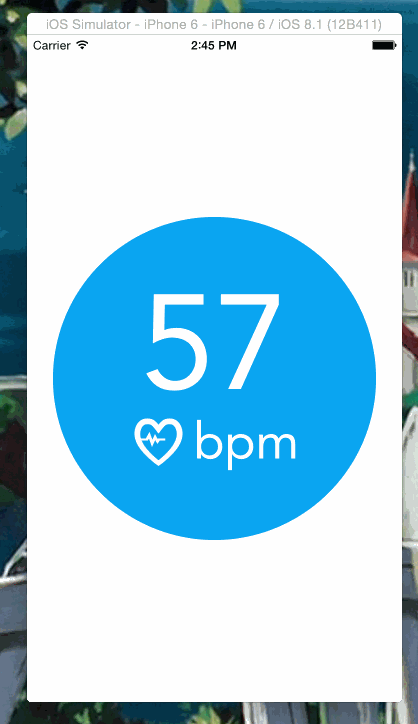

footer: © Michael Helmbrecht, 2014
slidenumbers: true

# [fit] DESIGN⠀<br>TIME

---

# [fit] IBDesignable

#### [Technically a toolchain feature, but WWDC 2014 is all a blur.]

---

# Today we will be building



---

# Just one keyword

``` swift
@IBDesignable
class HeartRateMeter: UIView {

  // ...lots of great view code in here...

}
```

---

# Automagically :



^ This will rerender every time you save (unless you turn that off).

---

# I lied, here's another keyword
## But in fairness it's not _necessary_

``` swift
@IBDesignable
class HeartRateMeter: UIView {

  @IBInspectable var textColor: UIColor = UIColor.whiteColor() {
    didSet {
      // ...update the UI...
    }
  }

}
```

^ You have to give the property an explicit type if you use `didSet`, but `@IBInspectable` doesn't care.

^ Default values work the way you'd think, overridden by IB values.

---

# Automagically :



---

# [fit] Craig-approved inspectable types

- Int/Float/Double
- String
- Bool
- CGPoint/CGSize/CGRect
- UIColor
- UIImage

^ All the various number types seem to work. No bounds checking on these things though.

---

# How it works

1. IB calls your view's `init(frame:)` method
    - but it calls `init(coder:)` when running
2. IB calls your view's `prepareForInterfaceBuilder()`
3. IB does the standard layout/drawing stuff

^ Fun fact: `prepareForInterfaceBuilder()` is a method of `NSObject`, so you could presumably override it on lots of things. I haven't tried that though.

---

# Providing test data for IB

``` swift
override func prepareForInterfaceBuilder() {
  self.heartRate = 95
}
```

### __You could make the desired parameter inspectable, but that only works if it's one of the approved types.__
### __Plus this is only executed when building in IB, and not when the app is run.__

---

# **Caveat**: Images won't work
## Yep, that's a known issue.

``` swift
override func prepareForInterfaceBuilder() {
  self.icon.backgroundColor = self.textColor
}
```

---

# Questions?

This demo project and this talk at [link.mrh.is/designtime](link.mrh.is/designtime).

I'll be around after the talks,<br>or find me at [@mrh_is](http://twitter.com/mrh_is).


